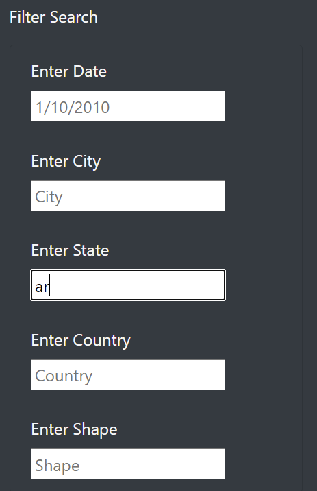
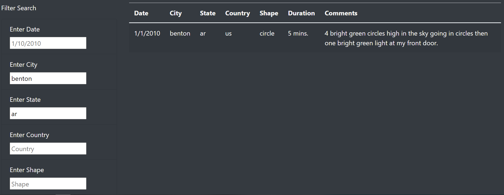

# UFOs
Bootcamp Module 11

## Overview
The purpose of this webpage is to allow users to peruse a list of UFO sightings from across several countries and states or provinces. The list is able to be filtered by date, city, state, country and shape. 

## Results
To use the webpage, the user can either simply scroll through the unfiltered list of sightings, or they can apply any of the available text filters. The process for using the filters is shown in the following section.

### 1. Navigate to the list
Scroll down the webpage to the table of sightings and filter menu.

### 2. Type Filter Text
Add text to the desired filter field. Note that the text must be an exact match. In this example, the state is being filtered to "ar".

### 2. Press Enter or Exit Field
When the use presses "Enter" or steps out of the field, the filter is applied to the table. The filter on state from the previous step is shown below.

### 3. Apply Multiple Filters
Multiple filters can be applied simultaneously. To drop a filter, simply remove any pre-existing text. In this example only the city "benton" and the state "ar" appear in the list. The other fields remain blank and do not apply any filters.

## Summary
One drawback of this page is that the user is expected to already know which values are available for filters, and expected to type it perfectly. 

Changing the types of input fields to pick-lists would help with entering dates of specific formats, and showing which cities, states, countries, or shapes are available to filter by. Alternatively, the text filtering could be made more flexible by always converting the input text to lowercase to compare against the data set. 

Adding a scrollbar to the table would also allow the user to explore all values in the table, without losing the filter pane.